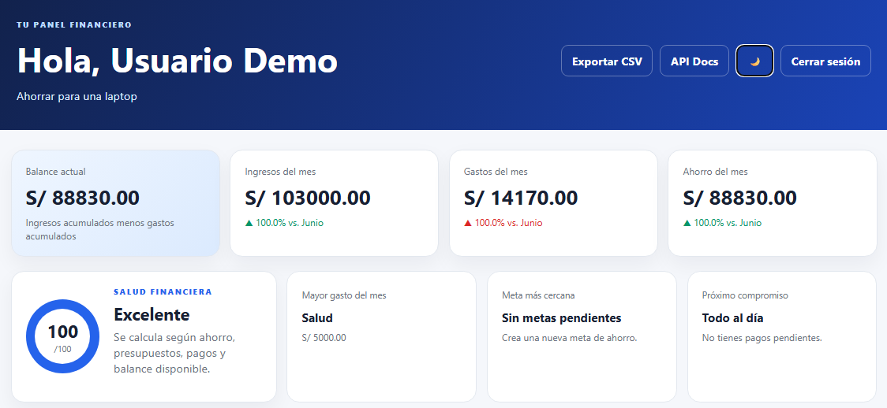
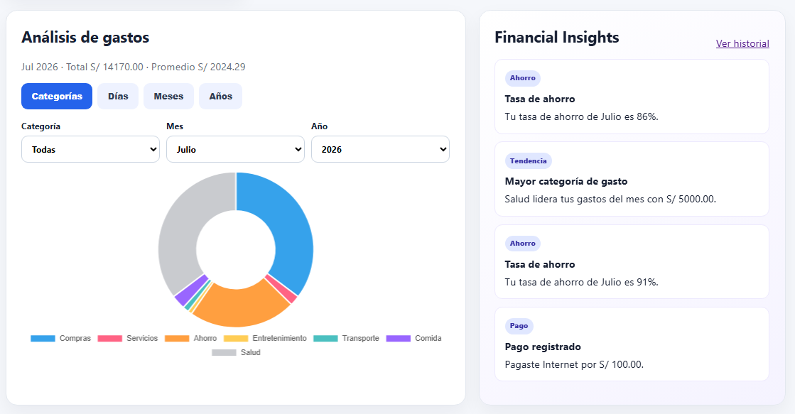
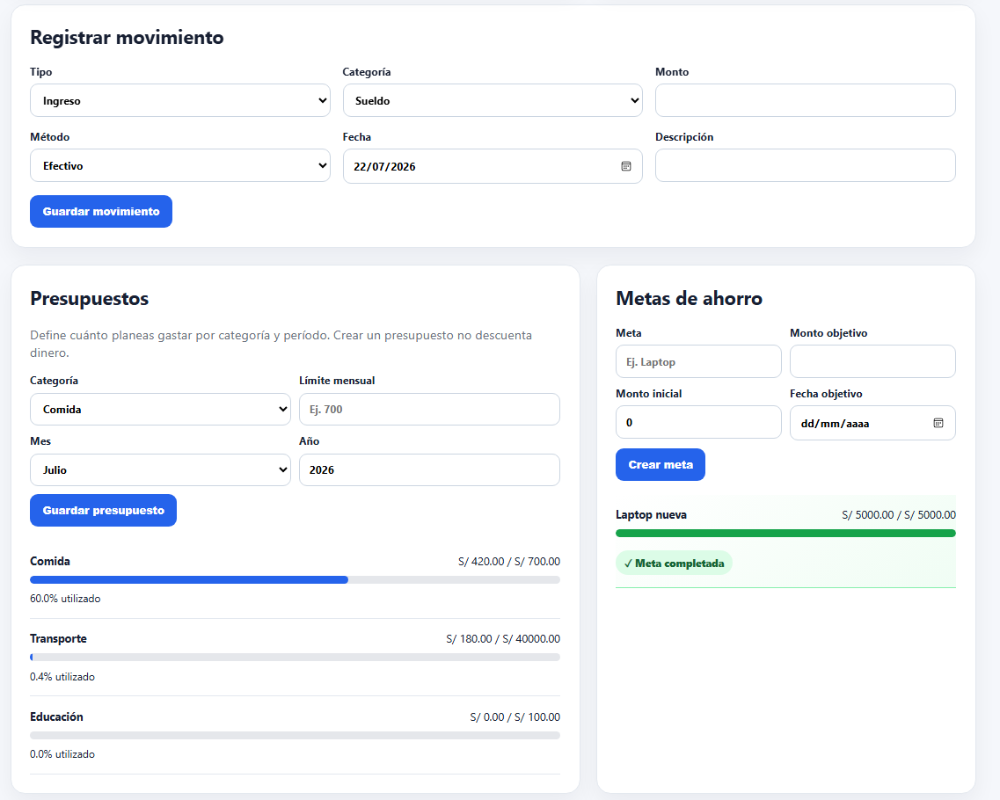
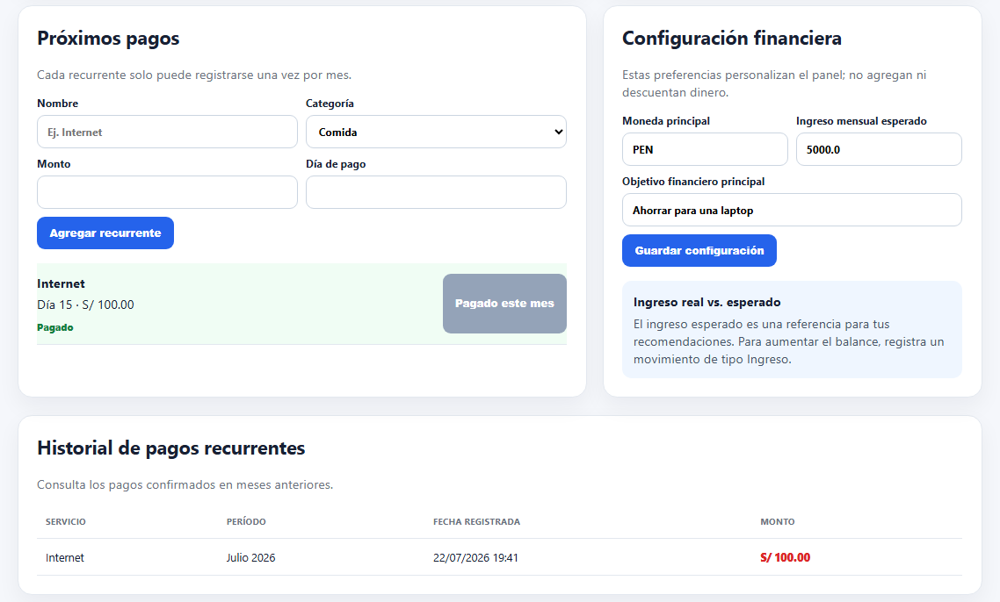
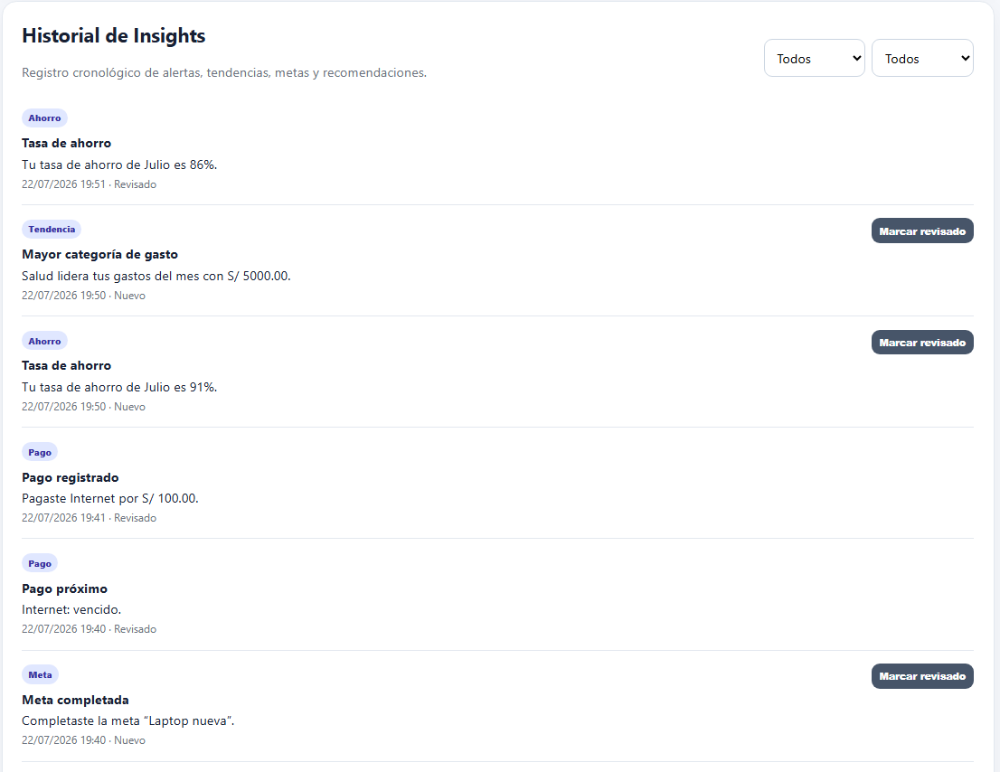
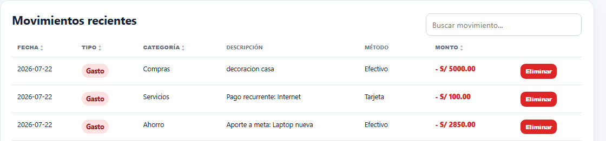

# 💰 Finance Tracker Pro

Finance Tracker Pro es una aplicación web de finanzas personales desarrollada para ayudar a los usuarios a administrar sus ingresos, gastos y objetivos de ahorro desde un solo lugar.

El proyecto fue desarrollado con el objetivo de aplicar buenas prácticas de desarrollo backend utilizando FastAPI, implementando autenticación con JWT, persistencia de datos, visualización de información mediante gráficos y una interfaz web sencilla e intuitiva.

---

## 🚀 Características

- Registro e inicio de sesión con autenticación JWT.
- Gestión de ingresos y gastos.
- Balance financiero actualizado automáticamente.
- Presupuestos mensuales por categoría.
- Metas de ahorro con seguimiento del progreso.
- Gastos recurrentes con control de pagos mensuales.
- Historial de pagos recurrentes.
- Financial Insights generados automáticamente.
- Gráficos interactivos por categoría, día, mes y año.
- Comparación de ingresos, gastos y ahorro con el mes anterior.
- Indicador de salud financiera.
- Exportación de movimientos en formato CSV.
- Tema claro y oscuro.
- API documentada con Swagger.

---

## 🛠 Tecnologías utilizadas

- Python
- FastAPI
- SQLModel
- SQLite
- PostgreSQL
- JWT
- Jinja2
- HTML
- CSS
- JavaScript
- Chart.js
- Docker
- Pytest

---

## 📷 Capturas

### Dashboard principal


### Análisis de gastos e Insights


### Presupuestos y metas de ahorro


### Pagos recurrentes


### Historial de Insights


### Movimientos recientes


---

## ▶️ Instalación

Clonar el repositorio

```bash
git clone https://github.com/SainouP/finance-tracker-pro.git
cd finance-tracker-pro
```

Crear el entorno virtual

```bash
python -m venv .venv
```

Activarlo

### Windows

```bash
.venv\Scripts\activate
```

### Linux / macOS

```bash
source .venv/bin/activate
```

Instalar dependencias

```bash
pip install -r requirements.txt
```

Ejecutar la aplicación

```bash
python -m uvicorn app.main:app --reload
```

La aplicación estará disponible en:

```
http://127.0.0.1:8000
```

Documentación de la API:

```
http://127.0.0.1:8000/docs
```

---

## 🧪 Pruebas

Para ejecutar las pruebas automatizadas:

```bash
python -m pytest -q
```

---

## 🗄 Base de datos

Durante el desarrollo se utilizó **SQLite**, ya que facilita la configuración y las pruebas locales.

La aplicación también es compatible con **PostgreSQL** mediante la variable de entorno `DATABASE_URL`, permitiendo su despliegue en servicios como Render.

---

## 📂 Estructura del proyecto

```
app/
├── routers
├── templates
├── static
├── models
├── database
└── main.py

tests/
README.md
Dockerfile
docker-compose.yml
```

---

## 📌 Objetivo del proyecto

Este proyecto forma parte de mi portafolio personal y fue desarrollado para fortalecer mis conocimientos en desarrollo backend con Python, diseño de APIs REST y manejo de bases de datos, implementando una aplicación con funcionalidades cercanas a un escenario real.

---

## 👨‍💻 Autor

**Rodrigo Ramiro Jara Perez**

- GitHub: https://github.com/SainouP
- LinkedIn: https://www.linkedin.com/in/rodrigo-ramiro-jara-perez-056602358/

---

## 📄 Licencia

Este proyecto está disponible bajo la licencia MIT.